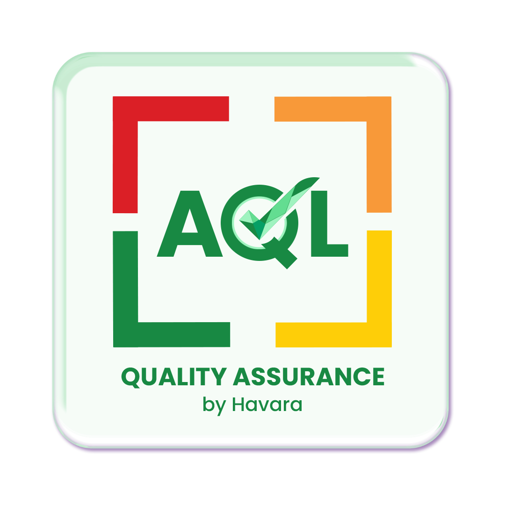
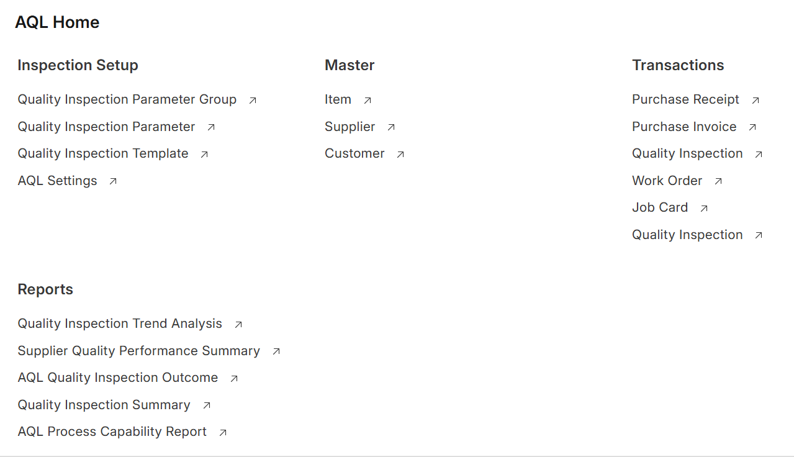
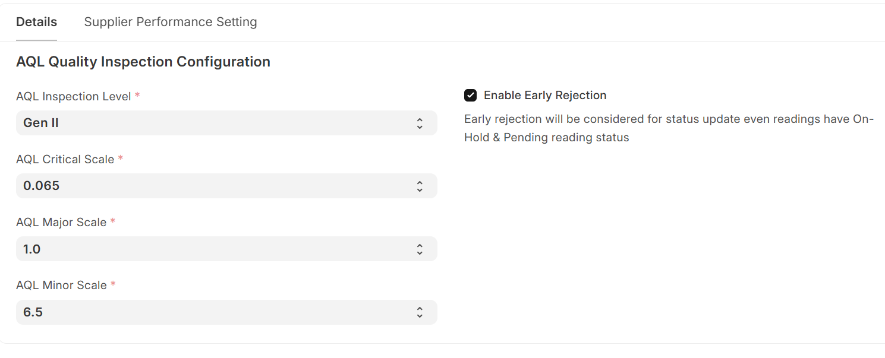
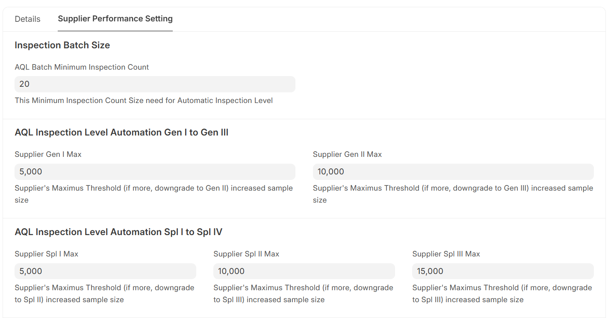
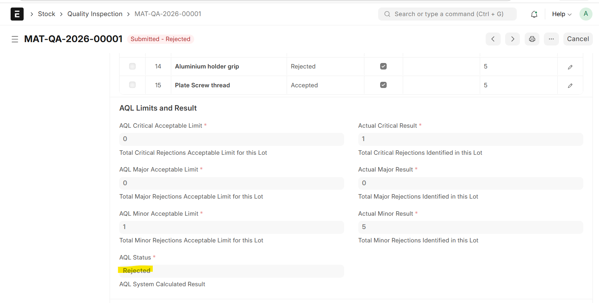

  

<h1 align="center"> AQL Quality Assurance for ERPNext</h1>
AQL Quality Assurance is an ERPNext app that automates lot-based quality inspections using international AQL (Acceptance Quality Limit) standards and integrates them directly into ERPNext’s operational workflows.

## Overview
This app extends **ERPNext’s** standard Quality Inspection to support statistically valid sampling, defect classification (Critical/Major/Minor), and automated pass/fail lot disposition for incoming materials, in‑process operations, internal stock movements, and outgoing shipments.

## Key goals:
- Replace legacy QMS with a tightly integrated ERPNext solution.
- Enforce quality gates at key transactions (Purchase Receipt, Job Card, Stock Entry, Delivery Note).
- Standardize inspection methods across sites and products using AQL tables and reusable templates.

## Core Features
### AQL Table Integration
Uses ANSI/ASQ Z1.4-style AQL tables to automatically derive sample size and acceptance numbers based on lot quantity and inspection level.

### Enhanced Quality Inspection
Multiplies parameters by sample size to generate a complete inspection grid (sample-wise or parameter-wise), capturing numeric, pass/fail, and text results per unit.

### Defect Classification & Decision
Classifies results as Critical, Major, or Minor defects and computes a single Boolean lot decision (Pass/Fail) using AQL acceptance criteria.

### Configurable Quality Gates
Can block or warn on transaction submission when inspections fail, with optional override permissions for authorized users.

### Reusable Parameter Templates
Templates define parameters, ranges, defect category, and mandatory/optional flags, and are linked to items for automatic selection.
  

<table>
  <tr>
    <td></td>
  </tr>
  <tr>
    <td></td>
    <td></td>
  </tr>
  <tr>
    <td></td>  
    <td></td>  
  </tr>
</table>
 

## Process Flow
#### 1. Master Data Setup
Mark items that require AQL inspections and link them to one or more inspection parameter templates (incoming, in‑process, outgoing).

Maintain Supplier–Item and Customer–Item inspection levels (e.g., Level I/II/III, special levels) based on risk and past performance.

Configure global app settings: AQL standard, default test mode (sample-wise vs parameter-wise), and gate behavior (block vs warning).

#### 2. Incoming Material Inspection (Purchase Receipt)
User creates a Purchase Receipt in ERPNext. Items flagged “Inspection Required” trigger or request an AQL Quality Inspection.

The app reads lot quantity and supplier-specific inspection level and uses the AQL table to calculate sample size and allowed defects per category.

An inspection grid is generated from the selected item template (parameters × samples); the inspector records test results for each sampled unit.

The app aggregates defects, applies AQL rules, and sets the lot to Pass or Fail, updating the Purchase Receipt status accordingly (allow, block, or warn on submission).

#### 3. In‑Process Inspection (Production Job Card)
On completion of a critical operation or Job Card, a Quality Inspection is created against the Job Card with the relevant in‑process parameter template.

Sample size is derived from produced quantity and configured inspection level for that operation/item.

Inspectors test semi‑finished units and record results; the lot decision can control Job Card closure and subsequent movements (e.g., rework vs next operation).

#### 4. Internal Stock Transfers (Warehouse to Warehouse)
When creating a Stock Entry – Material Transfer for items configured for transfer inspection, the system requires/requests a linked Quality Inspection.

AQL sampling and evaluation are performed on the transfer lot; pass/fail determines whether the transfer is allowed or held (e.g., stay in quarantine, move to rejected area).

#### 5. Outgoing Shipment Inspection (Delivery Note)
For Delivery Notes, items with outgoing inspection enabled trigger a Quality Inspection, using the Customer–Item inspection level and a shipment-specific template.

Sample size and acceptance numbers are computed from the AQL table; the inspector validates final visual, functional, and packaging parameters on sampled finished units.

The lot decision (Pass/Fail) controls shipment release, and a detailed AQL report (lot details, sample size, level, defect summary, decision) can be exported as PDF and attached to the Delivery Note for customer certification.

## Technology
Built on Frappe/ERPNext as a separate app, without modifying ERPNext core DocTypes.

Uses ERPNext’s standard linking to transactional DocTypes (Purchase Receipt, Job Card, Stock Entry, Delivery Note) and extends Quality Inspection with AQL logic and templates.

## Sponsor
Project Sponsor: Hotset GmbH, Germany (https://www.hotset.com/en/)
